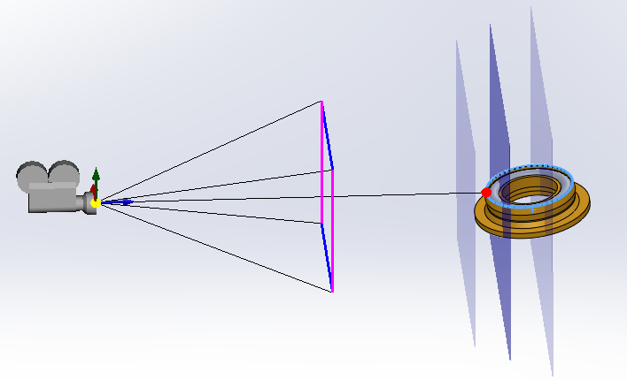
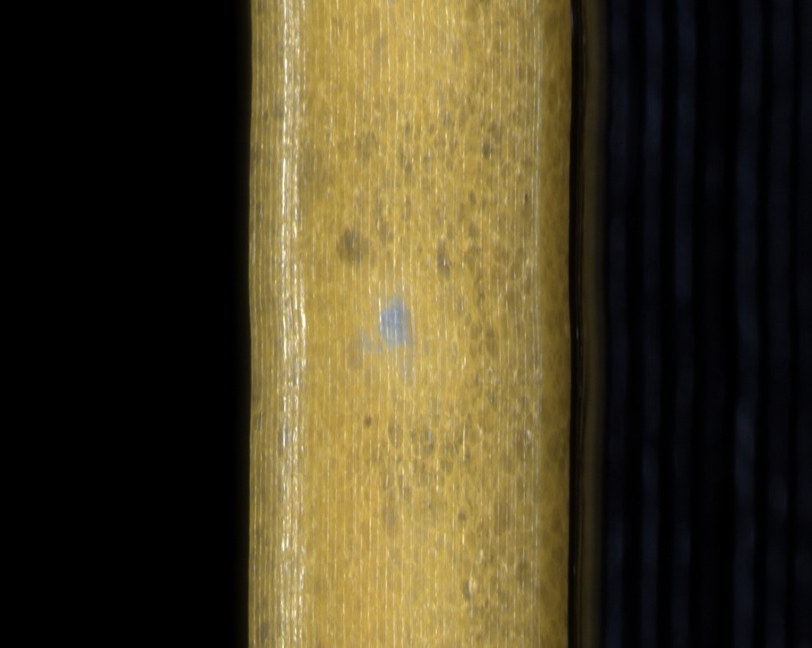
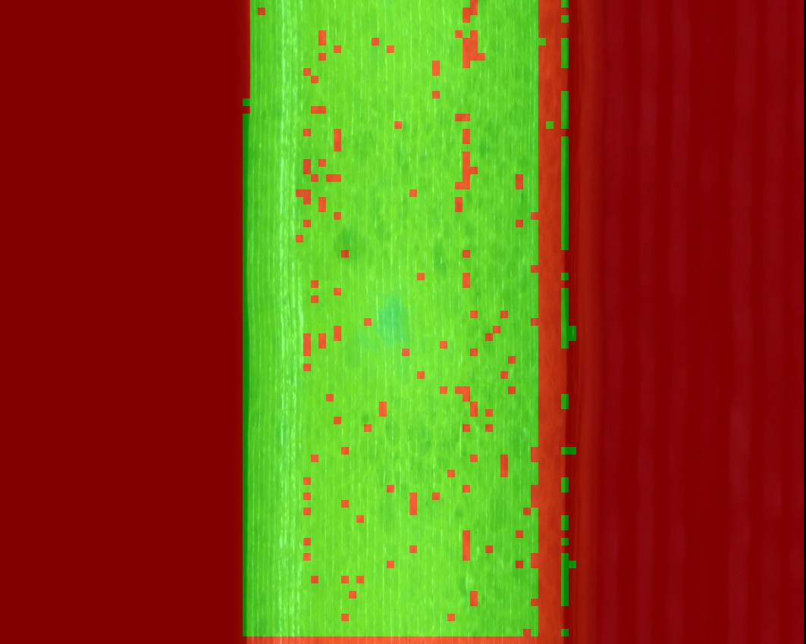

# Image Sharpness Mapping (Python, Laplacian variance)

## Description
This repository implements a blockwise sharpness mapping algorithm in Python using Laplacian variance. It is particularly useful for assessing the depth of field of optical systems with limited depth of field. By translating the camera to capture successive planes (first focus plane, best focus plane, last focus plane), the algorithm can be applied to verify whether the sharpness maps of the first and last planes are similar.

<p align="center">
  <br/>
  Visualization of focal planes within the depth of field
</p>

## Quick Start
Clone the repository:
```bash
git clone https://github.com/nellbru/image-sharpness-mapping.git
cd image-sharpness-mapping
```
Run the script:
```bash
python sharpness.py
```

This script calculates the blockwise Laplacian variance, applies a threshold to classify sharp regions, overlays the result for visualization, and saves the output image.

## Results
All generated figures are saved to **Results/**. The result shows the original image with a transparent overlay marking blocks classified as sharp (based on variance threshold).

<p align="center">
  
  <br/>
  Source image and result
</p>


## Project Structure
    image-sharpness-mapping/
    ├─ Images/          # Sample inputs (add your own images)
    ├─ Results/         # Results
    ├─ docs/            # Documentation assets
    ├─ sharpness.py     # Sharpness mapping script
    ├─ .gitignore       # Git ignore rules
    ├─ LICENSE          # Project license
    └─ README.md        # Project documentation

## Requirements
- Python 3.12+
- opencv-python
- numpy

## License
This project is licensed under the terms of the [LICENSE](LICENSE) file.
